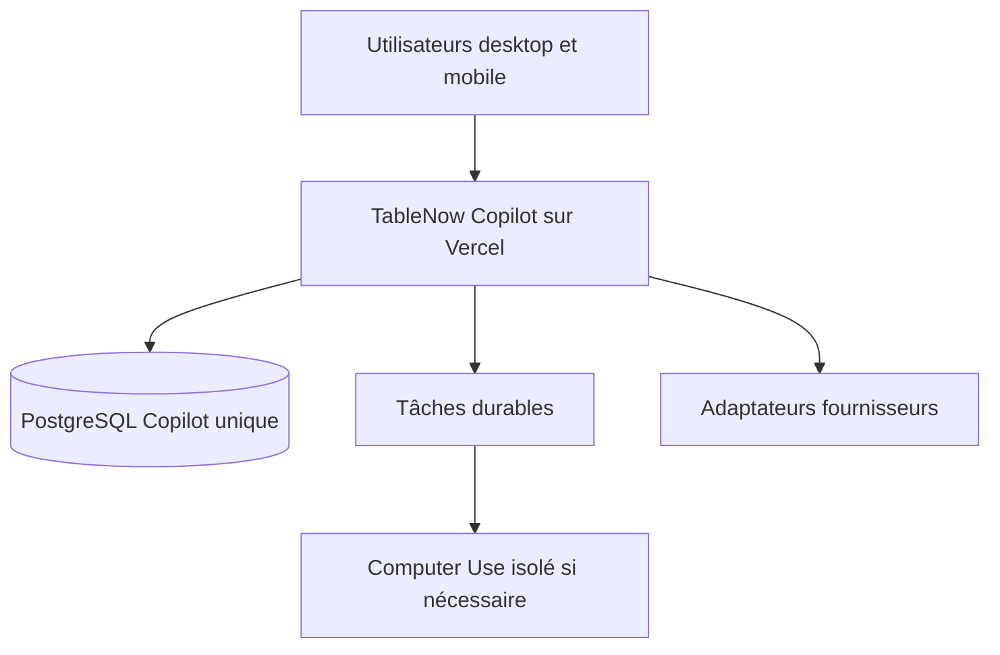

# Carte du système

## Cible pilote Vercel-first

## Responsabilités

| Pièce | Rôle |
|---|---|
| Console | Affiche les neuf espaces et reçoit les actions humaines. |
| API métier | Vérifie les droits et applique les règles TableNow. |
| PostgreSQL | Conserve l'unique état durable de Copilot. |
| Tâches durables | Exécute les travaux différés sans les perdre. |
| Adaptateurs | Traduisent TableNow vers email, calendrier, logiciels et IA. |
| Computer Use | Utilise une interface externe uniquement lorsqu'aucun accès plus fiable n'existe. |
| MCP | Expose des outils sûrs en passant toujours par l'API métier. |

Le code est un monolithe modulaire : une seule fondation cohérente, séparée en composants testables.
