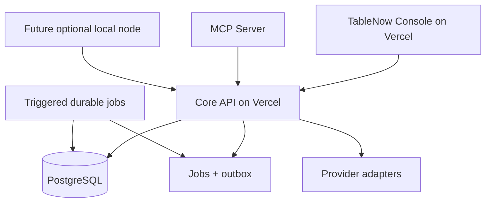

# Architecture

## Deployment model

The product is a modular monolith. The private cloud pilot uses one Vercel control plane and one managed PostgreSQL source of truth; the same modules remain separately runnable for local development, recovery and a future restaurant node.

## Packages

| Package | Responsibility | Must not do |
| --- | --- | --- |
| `domain` | permissions, invariants, approval and risk rules | network or database access |
| `contracts` | validated API and event schemas | provider-specific logic |
| `provider-adapters` | PostgreSQL, email, storage and model adapters | decide business policy |
| `agent-runtime` | model/tool orchestration, budgets, approvals, idempotency | bypass the Core API |
| `mcp-server` | expose safe TableNow tools over MCP | connect directly to PostgreSQL |

## Tenant model

A `tenant` is an independent restaurant or a restaurant group. A `restaurant` is an establishment within that tenant. Users join tenants through `memberships`; a user may later join several groups without duplicating identity.

Every business table includes `tenant_id`. API repositories always include it in predicates, and RLS policies independently verify the tenant set on the transaction.

## Portability and future local mode

- `docker compose up` provides console, API, worker, PostgreSQL and local mail for development and future node validation.
- The cloud pilot does not run a second container backend or dual-write path.
- A future node must stay operational without cloud sync or external AI once that mode is explicitly activated.
- AI providers implement an OpenAI-compatible interface; the deterministic local provider remains available.
- Files use either a local filesystem adapter or an S3-compatible adapter.
- Synchronization is opt-in and uses idempotent events, cursors and a per-node credential.
- Cloud services are deployment choices, never imports in domain code.

## Data onboarding sequence

1. Start every pilot with synthetic data in an isolated Preview.
2. Validate the operating mode selected by the restaurant.
3. Map any authorized external export without writing back to its source.
4. Import through versioned, idempotent adapters with a reconciliation report.
5. Enable synchronization only after conflict and duplicate tests pass.
6. Promote only the exact Vercel artifact and migrations verified in Preview.
